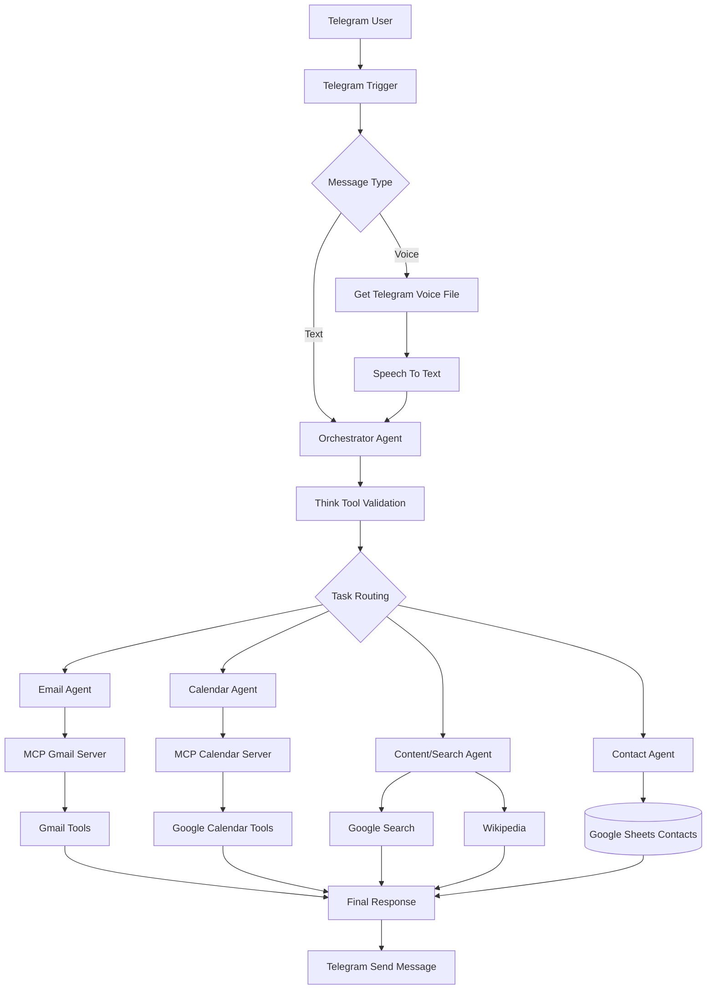
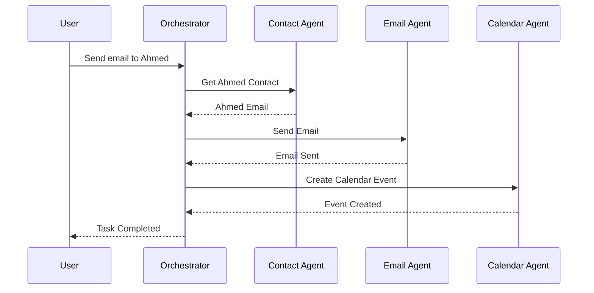

# 🤖 AI Executive Assistant – Multi-Agent System

> Built by Mahmoud Yasser using n8n, Telegram, MCP Servers, and AI Agents.

---

# 📌 Overview

This project is an advanced **Multi-Agent AI Assistant** built with **n8n**.

The system receives **text and voice messages from Telegram**, understands the user's intent using an **Orchestrator Agent**, then routes the request to specialized agents like:

- Contact Management Agent
- Email Agent
- Calendar Agent
- Content/Search Agent

The architecture follows a modern **AI Orchestration Pattern** with modular agents and tool-based execution.

---

# 🏗️ System Architecture



---

# ⚡ Features

## ✅ Multi-Agent Architecture
Specialized AI agents for different domains.

## ✅ Telegram Integration
Supports:
- Text Messages
- Voice Messages
- Audio Notes

## ✅ Voice-to-Text Pipeline
Voice messages are automatically transcribed before processing.

## ✅ Email Automation
- Send Emails
- Draft Emails
- Reply to Emails
- Label Emails

## ✅ Calendar Automation
- Create Events
- Update Events
- Delete Events
- Manage Attendees

## ✅ Contact Management
Google Sheets acts as a lightweight CRM database.

## ✅ AI Content Generation
Generate full blog posts and research articles using:
- Google Search
- Wikipedia

---

# 🧠 Main Orchestrator Agent

The Orchestrator Agent acts as the brain of the system.

Responsibilities:

- Understand user intent
- Route requests to the correct agent
- Enforce execution rules
- Validate actions using Think Tool

---

# 🔀 Agents

## 📇 Contact Agent

Manages contacts using Google Sheets.

### Tools
- Get Contact
- Add or Update Contact

### Database
Google Sheets

---

## 📧 Email Agent

Handles Gmail operations.

### Tools
- Send Email
- Get Emails
- Email Reply
- Create Draft
- Get Labels
- Label Emails

### Rules
- Emails must be HTML format
- Must fetch message IDs before replying
- Must fetch label IDs before labeling

---

## 📅 Calendar Agent

Handles Google Calendar operations through MCP.

### Tools
- Create Event
- Update Event
- Delete Event
- Get Event
- Get Many Events

### Rules
- Contact lookup required before attendee events

---

## 🔍 Content/Search Agent

Research and article generation agent.

### Tools
- Google Search
- Wikipedia

### Responsibilities
- Research topics
- Validate information
- Generate complete articles

---

# 🧩 Tech Stack

| Technology | Purpose |
|---|---|
| n8n | Workflow Automation |
| Telegram Bot API | Messaging Interface |
| Google Gemini | AI Models |
| MCP Servers | Tool Integration Layer |
| Gmail API | Email Automation |
| Google Calendar API | Calendar Automation |
| Google Sheets API | Contact Database |
| Wikipedia API | Knowledge Source |

---

# 🛡️ Execution Rules

## Contact First Rule

Before:
- Sending emails
- Drafting emails
- Creating calendar events with attendees

The system MUST:
1. Use Contact Agent
2. Retrieve contact email
3. Pass validated email to next agent

---

# 🔄 Workflow Example

## User Request

```text
Send an email to Ahmed and schedule a meeting tomorrow at 5 PM
```

## Execution Flow



---

# 🧠 Architecture Pattern

This project follows:

- Multi-Agent Systems
- Tool-Using AI Agents
- Orchestrator Pattern
- Event-Driven Architecture
- Modular Workflow Design
- MCP-Based Integration Layer

---

# 🚀 Future Improvements

- Vector Database Memory
- RAG Pipeline
- Long-Term Memory
- Human Approval Layer
- Observability & Logging
- WhatsApp Integration
- Slack Integration
- Notion Agent
- CRM Integrations

---

# 👨‍💻 Author

## Mahmoud Yasser

AI Automation Engineer specialized in:
- AI Agents
- n8n Automation
- MCP Servers
- Workflow Systems
- AI Integrations

---

# ⭐ Project Vision

Building a fully autonomous AI executive assistant capable of:

- Communication
- Scheduling
- Research
- Productivity Automation
- Knowledge Management
- Multi-step reasoning

---

# 📄 License

MIT License
